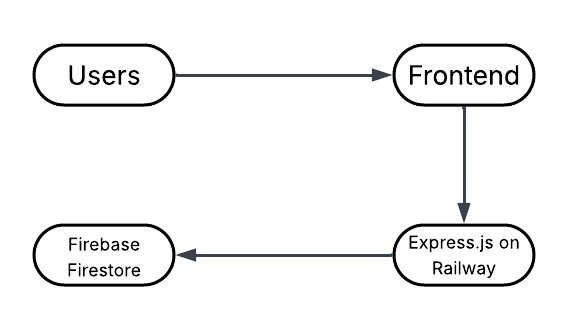

# User Interaction Logging System
🚀 This is a personal project I built by myself. This is a user interaction logging system designed to track and store user activities, such as clicks and form submissions that **works on a real website**. The main goal is to show how we can collect useful behavioral data using modern web technologies — in a safe and developer friendly way.

🎦 This is the YouTube video showing that this system really works on a real website:\
https://youtu.be/6DJq5xxGnmI\
2nd Video:\
https://youtu.be/A-GmsVaA5fo

💻 The website used as the frontend in this project was built 100% by myself during my college.

🌐 Live Demo\
Frontend Repo (hosted on GitHub):\
https://github.com/Malvoria123/User-Interaction-Logging-System.git

Frontend (hosted on GitHub Pages):\
https://malvoria123.github.io/User-Interaction-Logging-System/sites/index.html

Backend Repo (hosted on GitHub):\
https://github.com/Malvoria123/Interaction-Logger-Backend.git

Backend API (deployed on Railway):\
https://interaction-logger-backend-production.up.railway.app/api

🧠 What This Project Does\
\
This system logs user interactions (clicks and form submissions) on a website and stores them in a secure cloud database. For clicks, it collects:
1. Clicked Products
2. Product Names
3. Timestamps (Date)
4. User Agents (Browser, OS, and Device Information)
5. Screen Widths and Heights

For form submissions, it collects:
1. No. 3, 4, and 5 above
2. First Names
3. Last Names
4. Phone Numbers
5. Email Addresses
6. Genders
7. Problem Descriptions

✅ Why is this useful?\
This user interaction tracking is valuable for:
1. UI/UX designers and developers to understand user behavior and interaction.
2. Product managers to improve features based on interaction data.
3. Marketing and analytics to increase site flow and engagement.

🧰 Tech Stack Used
| Part | Tools | Why I chose it |
| --- | --- | --- |
| **Frontend**  | HTML, CSS, JavaScript, GitHub Pages | Simple, Industry-Standard, and Free |
| **Backend** | Express.js (Node.js), Railway | Lightweight, Powerful, and Easy to Deploy |
| **Database** | Firebase Firestore | Scalable, No Setup, Real-Time, Free Tier |
| **Versioning** | Git & GitHub | Open Source Hosting |
| **Editor** | Visual Studio Code (VSCode) | Feature-rich and Widely Used by Developers |
| **AI Assistant** | ChatGPT, Qwen, Deepseek, etc. | To Help with Faster Writing, Coding, Debugging, and Fixes |

🚀 Why These Tools?\
**Express.js**: It’s a minimal, fast Node.js framework — perfect for building lightweight APIs.

**Railway**: Railway makes it easy to deploy Node.js/Express backends quickly with seamless GitHub integration. Plus, it offers a free tier that’s perfect for small-scale projects.

**Firebase Firestore**: Cloud-hosted, scalable NoSQL database — no need for backend management, easy to use, and free for small projects.

I chose these to focus on practicing data collection, while keeping deployment and setup simple.

🛡️ Security Features\
This project is not just about logging — it’s also safe and secure:
1. **Rate Limiting**: Max 50 requests (May be adjusted) per 15 minutes per IP using express-rate-limit to prevent spam or abuse.
2. **CORS Restriction**: Only accepts requests from https://malvoria123.github.io to prevent cross-site attacks.
3. **API Key Protection**: All requests must include a valid API key in headers for authentication.

🧩 This is how I did this project:\
**> Frontend Setup**
1. Create HTML pages with clickable elements and forms.
2. Add scripts that listens for user clicks and submissions and sends logs to backend.

**> Backend Setup**

1. Use Express.js to create a POST endpoint to accept logs.
2. Secure it with CORS, API key checking, and rate limiter.
3. Use Firebase Admin SDK to send logs into Firestore.

**> Deploy**

1. Push frontend to a GitHub repo and deploy with GitHub Pages.
2. Push backend code to another GitHub repo and deploy it on Railway.
3. Set environment variables like API_KEY, PORT and FIREBASE_SERVICE_ACCOUNT on Railway.

**> Test**
1. Open frontend, click elements, make form submissions, and check if logs are saved in Firestore.
2. Use browser console or curl to simulate requests and test security limits.

💡 What I Learned
1. How to connect front-end, backend, and database together
2. How to protect APIs using CORS and API Keys
3. How to deploy real-world apps using Railway and GitHub
4. How to use AI to improve productivity and problem solving

📌 Future Improvements
1. Add user session tracking or anonymized IDs
2. Create a dashboard to visualize logs using charts
3. Add support for more event types (scroll, hover, etc.)

📬 Feedback or Contributions\
Feel free to contact me to discuss potential collaborations, provide feedback, report issues, or just say hello! I'm open to new ideas and opportunities. You can reach me via LinkedIn at https://www.linkedin.com/in/jason-pangestu-9a9a44248.

If you found this project helpful or interesting, don't forget to give it a star ⭐️ and share it with others who might benefit!

🚀 Thank you for your interest and support!